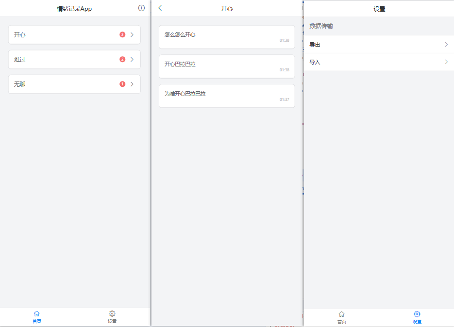

#### 一句话描述app

随时随地记录心情app。用户可创建不同的**情绪**，然后可继续产生该情绪相关**记录**。

#### 具体说明

**首页**
首页展示情绪列表（根据情绪产生的次数降序排列），右上角创建新的情绪。
1、长按情绪可进行编辑名称、删除情绪操作。
2、点击右侧箭头，可新增一条该情绪记录。
3、点击情绪名称，跳转情绪记录详情页。

**情绪记录详情页**
可查看情绪所有的记录（根据时间排序），包括产生的具体描述和时间。长按可编辑记录、转移记录、删除记录。

**设置页**
> 后续重创了项目，调整了开发软件和组件库。开发导入导出功能，用于转移之前使用应用产生的数据。

导出：将当前app数据保存成json文件 保存到应用私有目录
导入：上传符合app数据的json文件，解析数据到app中。

#### 截图

